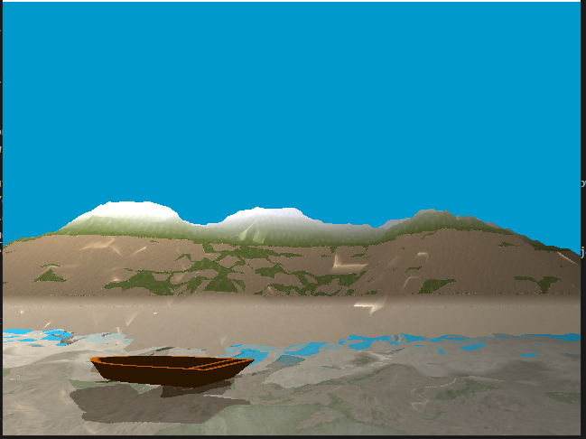
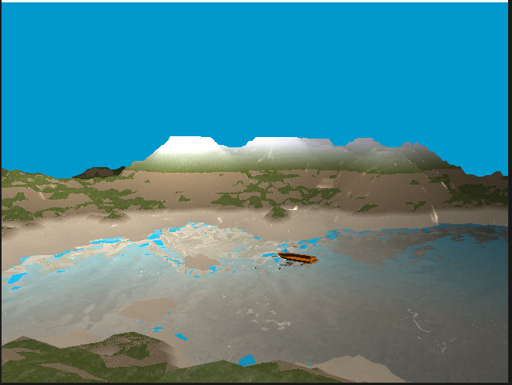

## Title: 

**Water simulation with object physics**

## Demo Link: 

**https://youtu.be/4Iyay7Gk1CA**

## Screenshots

**Images**

**How to run this project**

In order to run this project, you will need to have a version of OpenGL installed on your machine.
Then simply run 'dub' in the project directory.
